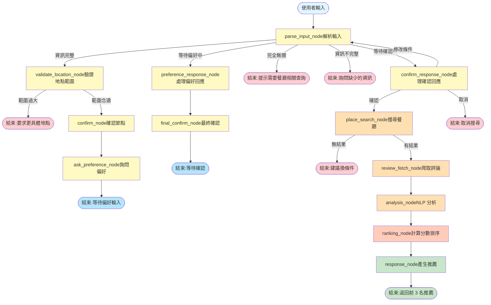

# Foodie Hunter

基於 LangGraph Agent、語意分析與即時爬蟲的智能餐廳推薦系統

## 專案概述

Foodie Hunter 是一個結合自然語言處理、Google Maps 資料與情感分析的智能餐廳推薦助手。系統透過多代理工作流程，根據使用者偏好搜尋、分析並排序餐廳，提供個人化的用餐建議。

## 專案結構

```
├── backend/
│   ├── app/
│   │   ├── data/
│   │   │   └── app.db                  # SQLite 資料庫檔案
│   │   ├── db.py                       # SQLAlchemy 資料庫模型
│   │   ├── db_writer.py                # 資料庫寫入輔助函式
│   │   └── init_db_run.py              # 資料庫初始化腳本
│   ├── recommender/
│   │   ├── models/                     # NLP 模型快取
│   │   ├── tools/
│   │   │   ├── place_info_tool.py      # Google Places API 工具
│   │   │   ├── review_scraper_tool.py  # Playwright 評論爬蟲
│   │   │   ├── embedding_tool.py       # Sentence-Transformers 語意分析
│   │   │   ├── gemini_tool.py          # Gemini LLM 推薦理由生成
│   │   │   └── test_scraper.py         # 爬蟲測試腳本
│   │   └── recommend_agent.py          # LangGraph Agent 主邏輯
│   ├── server.py                       # FastAPI WebSocket 伺服器
│   └── test_agent.py                   # Agent 測試腳本
├── frontend/
│   ├── index.html                      # 主頁面 HTML
│   ├── script.js                       # WebSocket 通訊與 UI 邏輯
│   └── style.css                       # Glassmorphism 樣式與動畫
└── README.md
```

## 安裝與執行

1. 安裝相依套件
```bash
pip install -r requirements.txt
playwright install chromium
```
2. 設定環境變數

建立 `.env` 檔案：
```
GOOGLE_API_KEY=your_google_places_api_key
GEMINI_API_KEY=your_gemini_api_key
```

3. 初始化資料庫
```bash
python init_db_run.py
```

4. 啟動伺服器
```bash
python server.py
```

伺服器將在 `http://localhost:8000` 啟動

### 前端訪問

開啟瀏覽器前往 `http://localhost:8000` 即可使用

## 使用範例

輸入範例查詢：
- "信義區火鍋"
- "東區適合約會的餐廳"
- "中央大學附近的咖啡廳"

系統將自動：
1. 解析地點與餐廳類別
2. 搜尋 Google Maps 資料
3. 爬取評論並進行語意分析
4. 根據匹配度與正面評價率排序
5. 生成個人化推薦理由

## 系統架構

### 後端架構

#### 核心component

**1. LangGraph Agent 流程**

系統透過狀態驅動的工作流程協調多個專業工具：



**流程說明：**

**第一階段：資訊收集與驗證**
- `parse_input_node`: 解析使用者輸入，提取地點、類別、偏好
- `validate_location_node`: 檢查地點範圍（太大則要求更具體）
- `confirm_node`: 資訊完整性確認轉接點

**第二階段：偏好與確認**
- `ask_preference_node`: 詢問飲食偏好（不吃辣、素食等）
- `preference_response_node`: 解析並分類偏好（強制/加分）
- `final_confirm_node`: 顯示完整搜尋條件摘要
- `confirm_response_node`: 處理確認（是/否/修改）

**第三階段：搜尋與分析**
- `place_search_node`: Google Places API 搜尋，強偏好過濾
- `review_fetch_node`: 並行爬取評論（Playwright）
- `analysis_node`: NLP 語意分析與情感分析
- `ranking_node`: 多維度評分（匹配度 70% + 正面率 20% + 評分 10%）
- `response_node`: 產生前 3 名推薦結果

**設計特色：**
- 漸進對話：分步收集資訊，避免一次性問太多
- 等待狀態：使用 `waiting_for_confirmation` 和 `waiting_for_preference` 標記
- 條件判斷：所有節點透過 `route_next` 動態決定下一步
- 容錯機制：任一步驟失敗都有適當的錯誤處理和使用者提示

**2. tools**

**Place Info Tool** (`place_info_tool.py`)
- Google Places API 整合，執行 Geocoding + Nearby Search + Place Details 三階段查詢
- `location_is_too_large()`: 檢查地點範圍，經緯度差距 > 0.2 度視為過大
- `search_restaurants()`: 返回餐廳基本資料（name, place_id, rating, address, phone, website, map_url）
- 語言設定：`language: "zh-TW"` 取得繁體中文結果
- 錯誤處理：API timeout 10 秒、`OVER_QUERY_LIMIT` 狀態檢查

**Review Scraper Tool** (`review_scraper_tool.py`)
- Playwright headless 爬取 Google Maps 評論
- 反偵測機制：移除 `navigator.webdriver`、真實 User-Agent、禁用圖片載入
- `scrape_reviews_tw()`: 自動點擊評論按鈕、滾動載入、解析 `div[data-review-id]`
- 時間與數量限制：`max_reviews=100`、`duration_limit=20` 秒
- 去重機制：使用 `set()` 避免重複評論

**Embedding Analysis Tool** (`embedding_tool.py`)
- Embedding Model: `sentence-transformers/paraphrase-multilingual-MiniLM-L12-v2`（多語言支援）
- Sentiment Model: `uer/roberta-base-finetuned-dianping-chinese`（大眾評論微調）
- `analyze_reviews()`: 計算 cosine similarity、情感分析、生成摘要
- 匹配度計算：`match_score = mean(cos_sim(偏好embedding, 評論embeddings))`
- Fallback 機制：模型載入失敗時返回預設分數 0.5

**Gemini Reasoning Tool** (`gemini_tool.py`)
- Google Gemini 2.5 Flash API 呼叫，Temperature=0.3
- `generate_reason()`: 根據餐廳名稱、評論摘要、偏好生成 2-3 句推薦理由
- Prompt 設計：貼心美食顧問語氣、繁體中文、避免 JSON 格式輸出
- `call_gemini()`: 通用 LLM 呼叫函式，用於意圖識別等任務
- 錯誤處理：API 失敗時返回 fallback 理由，sleep 1 秒重試

**3. 資料庫**

採用 SQLAlchemy ORM，包含三個核心資料表：

```python
Restaurant（餐廳）
├── id
├── place_id（Google Maps 唯一識別碼）
├── name, address, rating, phone, website
└── reviews（一對多關聯）

Review（評論）
├── id
├── restaurant_id
├── text（評論內容）
└── stars（星級評分）

Recommendation（推薦記錄）
├── id
├── user_input（原始查詢）
├── location, category（地點、類別）
├── top_place_ids（前三名 place_id，逗號分隔）
└── recommendation_json（完整排序結果 JSON）
```

**4. Agent state machine**

```python
State = {
    "user_input": str,              # 使用者輸入
    "location": str,                # 地點
    "category": str,                # 餐廳類別
    "preferences": list[str],       # 使用者偏好列表
    "restaurants": list[dict],      # 搜尋到的餐廳列表
    "review_batches": list[list],   # 評論批次資料
    "analyzed": list[dict],         # 分析後的餐廳資料
    "recommendations": list[dict],  # 推薦結果
    "ranked": list[dict],           # 排序後結果
    "next": str,                    # 下一個節點
    "message": str,                 # 系統訊息
    "waiting_for_confirmation": bool,  # 等待確認
    "waiting_for_preference": bool     # 等待偏好輸入
}
```

**5. API**
基於 FastAPI 的 WebSocket 伺服器（`server.py`）提供：
- 即時雙向通訊
- Agent 執行過程的串流進度更新
- 前端靜態檔案服務

### 前端架構

#### 介面設計

前端採用 Glassmorphism 與動態光影效果：

**核心特色：**

1. **左右佈局**
   - 左側：對話式聊天介面
   - 右側：即時推薦卡片展示

2. **互動式發光效果**
   - 滑鼠追蹤徑向漸層
   - 基於指標位置的圓錐遮罩
   - CSS 自訂屬性計算角度與距離動態調整光暈

3. **訊息效果**
   - 訊息氣泡淡入動畫
   - 自動捲動至最新內容
   - 區分使用者與系統訊息樣式

4. **推薦卡片**
   - 滑入式渲染動畫
   - 懸浮互動效果
   - 直接附上可點擊Google Maps 連結

#### 前後端協作
**WebSocket 通訊協定：**

```javascript
// 客戶端發送
ws.send(userInput)

// 伺服器回應類型
{
  type: "progress",           // 進度更新
  text: "正在搜尋餐廳..."
}

{
  type: "message",            // 對話訊息
  text: "已找到 10 間餐廳"
}

{
  type: "recommendations",    // 推薦結果
  data: [
    {
      name: "餐廳名稱",
      rating: 4.5,
      address: "地址",
      reason: "推薦理由",
      map_url: "Google Maps 連結"
    }
  ]
}

{
  type: "error",              // 錯誤訊息
  text: "處理請求時發生錯誤"
}
```

**渲染過程：**

1. 使用者在左側輸入查詢
2. WebSocket 發送訊息至後端
3. Agent 執行期間，伺服器推送進度更新
4. 前端即時顯示處理狀態訊息
5. 完成後，右側卡片區域渲染推薦結果

## Technology stack

### 後端
- **框架：** FastAPI（WebSocket 伺服器）
- **Agent 引擎：** LangGraph
- **語言模型：** Google Gemini 2.5 Flash
- **embedding模型：** sentence-transformers（MiniLM-L12-v2）
- **情感分析：** transformers（RoBERTa）
- **爬蟲引擎：** Playwright
- **ORM：** SQLAlchemy
- **資料庫：** SQLite

### 前端
- **核心：** JavaScript（無框架）
- **通訊：** WebSocket API
- **樣式：** CSS3（Glassmorphism、動態漸層）
- **動畫：** CSS Transitions、Keyframes

## 授權條款
本專案採用 MIT License 授權。
