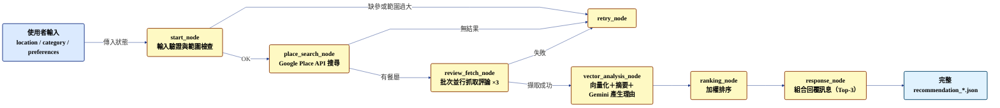

```mermaid
%%{init: {
  "theme": "base",
  "themeVariables": {
    "background": "#FFFFFF",
    "fontFamily": "Microsoft JhengHei",
    "fontSize": "20px",
    "primaryColor": "#1E3A8A",
    "primaryBorderColor": "#1E3A8A",
    "lineColor": "#1E3A8A",
    "edgeLabelBackground": "#FFFFFF"
  },
  "flowchart": {
    "curve": "linear",
    "nodeSpacing": 100,
    "rankSpacing": 120,
    "htmlLabels": true,
    "arrowMarkerAbsolute": true
  }
}}%%
graph LR

%% === 使用者層 ===
U0[使用者輸入<br/>location / category / preferences] -->|傳入狀態| S[start_node<br/>輸入驗證與範圍檢查]

%% === 應用層（LangGraph 節點） ===
S -->|OK| P[place_search_node<br/>Google Place API 搜尋]

S -->|缺參或範圍過大| R[retry_node]

P -->|有餐廳| RF[review_fetch_node<br/>批次並行抓取評論 ×3]

P -->|無結果| R

RF -->|擷取成功| VA[vector_analysis_node<br/>向量化＋摘要＋Gemini 產生理由]

RF -->|失敗| R

VA --> RK[ranking_node<br/>加權排序]

RK --> RESP[response_node<br/>組合回覆訊息（Top-3）]

%% === 輸出層 ===

RESP --> O1[完整 recommendation_*.json]

%% === 樣式定義 ===
classDef user fill:#DBEAFE,stroke:#1E3A8A,stroke-width:2px,rx:4px,ry:4px,color:#000,font-weight:700;
classDef logic fill:#FEF9C3,stroke:#92400E,stroke-width:2px,rx:4px,ry:4px,color:#000,font-weight:700;
classDef file fill:#E0F2FE,stroke:#0C4A6E,stroke-width:2px,rx:4px,ry:4px,color:#000,font-weight:700;

class U0 user;
class S,P,RF,VA,RK,RESP,R logic;
class O0,O1 file;
```